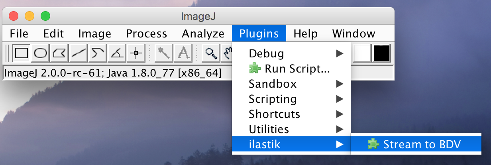
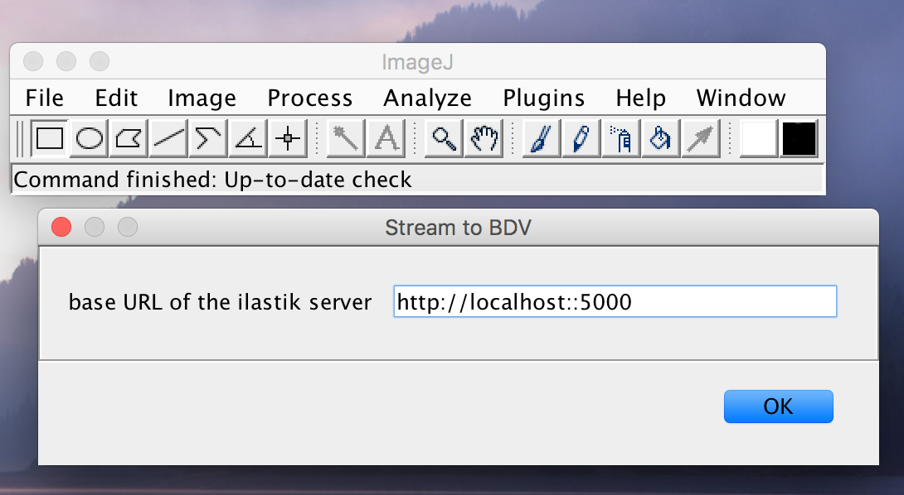
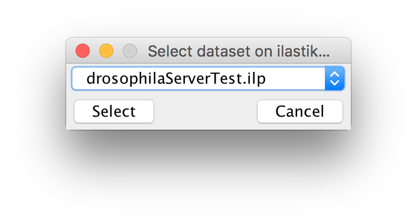
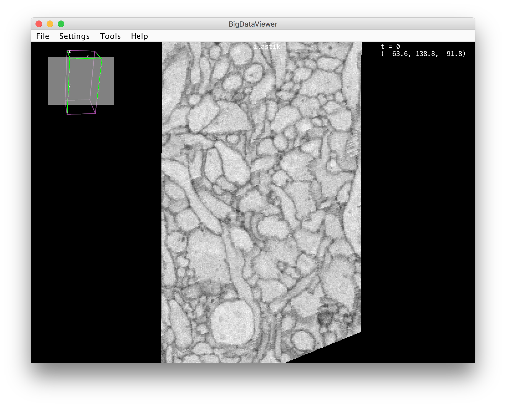

# Stream data from ilastik server to BigDataViewer

In the process of separating backend and frontend of ilastik, this ImageJ2 plugin provides an interface to stream data from our development version of the [ilastik server](https://github.com/ilastik/ilastik/tree/apistar) to BigDataViewer.

## ImageJ plugin

The plugin `IlastikToBdvStreamer` adds an entry to the `Plugin->ilastik` which allows you to provide the base URL of the ilastik server.

It then tries to obtain a listing of available ilastik pixel classification projects if the connection is successful, and lets the user select which one to stream.

Then, BigDataViewer opens and retrieves the raw data as well as the predictions maps from ilastik (one channel per BDV source). The keys `1`, `2`, `3`, etc allow you to switch between raw data and prediction map channels, `f` starts fused mode where colors are added up.

## Installation

Either use some IDE and run the file `IlastikToBdvStreamer`, or build the plugin jar (e.g. by running Maven in the top level dir of this repo: `mvn`). Then put the resulting jar into your ImageJ installation's `plugins` folder.